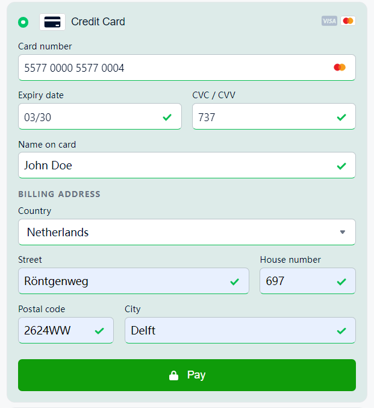
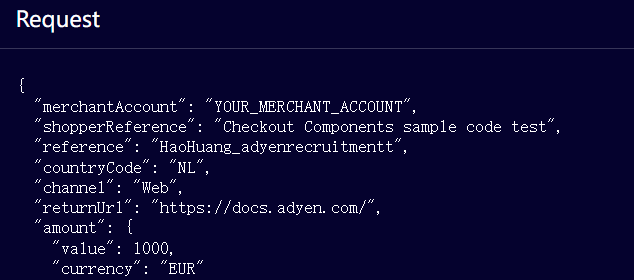
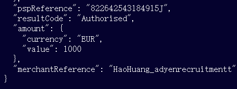

# Modified Drop-in 
### Start the server instance
Navigate to the root directory and start a Node.js server using Command Prompt
```
$ npm start
```
The server will start on `http://localhost:3000`.
The Modified Drop-in should appear at the top.

## Test the drop-in application.
Go to My Drop-in.
An identical UI as the original one should show up.
> Make sure to use a compatible version of node if the UI does not show up correctly(stuck in loading).
> In the beginning I tried using node v16.13.2 but the demo is stuck in loading. After switching to the older version v8.11.2(suggested version by Heroku) the demo loaded correctly.
```
$ nvm use 8.11.2
```
### Optional Configuration
This drop-in integration is configured to:
1. Only accept Visa and Mastercard.
2. Requires a billing address.
3. Requires the card holder's name.
4. Requires an expiry date later than 03/22

### Test with cards

Scroll down to Credit Card and test with one of the test cards.
The card holder's name and billing address are required. Picture above shows the information I used.
Upon successful payment, the psp reference should pop up in the bottom of response container.
>Request with required change


>Response with psp refernce


Here are some successful payment with PSP references.

| Test Card Number    | Card Issuer | pspReference     |
|---------------------|-------------|------------------|
| 4166 6766 6766 6746 | Visa        | 862642783030782G |
| 4000 6200 0000 0007 | Visa        | 862642783314706C |
| 4111 1111 1111 1111 | Visa        | 862642783335492E |
| 2222 4000 7000 0005 | MasterCard  | 862642783372340K |
| 2222 4107 0000 0002 | MasterCard  | 852642783419455B |
| 5577 0000 5577 0004 | MasterCard  | 882642783473529D |

### Additional CSS change
>**Changes in src/demo.css. Affects all demo pages**: Background color change to gray green
>**Changes in src/adyen.css (replacing the remote default css settings). Affects only My Drop-in page:** 
>1. Color change to green for checkout__button (different in hover, active and focus states).
>2. Color change to green for payment-method__radio--selected.

> ## Original README below


> ⚠️ **This repository is for demo purposes only**

## Requirements

To run this project, **create** a `.env` file on your project's root folder following the example on `.env.default`.

```
MERCHANT_ACCOUNT=MyMerchantAccount
CHECKOUT_APIKEY=MY_CHECKOUT_API_KEY
CLIENT_KEY=MY_CLIENT_KEY
```

These variables can be found in Adyen Customer Area. For more information, visit our [Get started with Adyen guide](https://docs.adyen.com/get-started-with-adyen#page-introduction).

If the forms don't seem to load, please check if you have:

1. Used the correct `clientKey`
2. Configured the `origin` on the Customer Area as an allowed origin

## Installation

### Running the PHP Server

Navigate to the root of the project and run the `start.sh` script:

```
$ cd adyen-components-js-sample-code
$ ./start.sh
```

A PHP server will start on `http://localhost:3000`.

### Running the Node.js Server

If preferred, you can run a Node.js server instead.
To do this, navigate to the root of the project, install the dependencies (only the first time) and run the start script:

```
$ cd adyen-components-js-sample-code
$ npm i
$ npm start
```

A Node.js server will start on `http://localhost:3000`.

### Deploying this example to Heroku

Alternatively, you can install this example by using this shortcut to deploy to Heroku:

[](https://heroku.com/deploy?template=https://github.com/Adyen/adyen-components-js-sample-code)

After deploying, to use Sessions Drop-in, add your ```CLIENT_KEY``` to the config vars.

## Documentation

For the complete integration guide, refer to the [Web Components documentation](https://docs.adyen.com/checkout/components-web/).

## Other sample projects

Find other sample projects in our [example projects repositories](https://github.com/adyen-examples).

## License

This repository is open source and available under the MIT license. For more information, see the LICENSE file.
